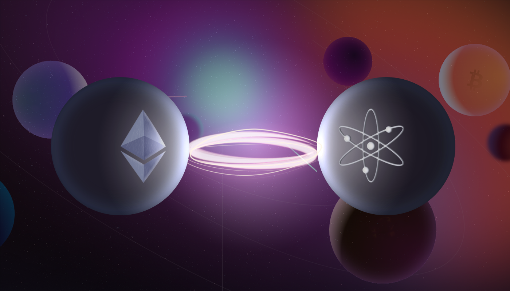
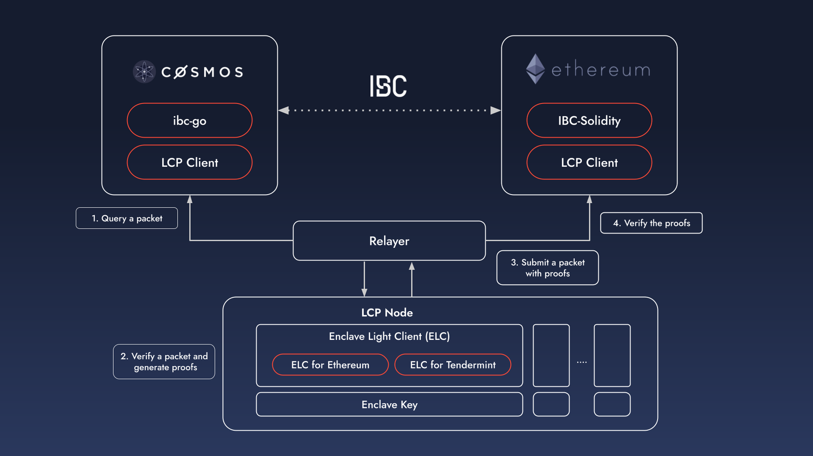

# cosmos-ethereum-ibc-lcp



This is a cross-chain messaging demo between Cosmos and Ethereum using IBC and LCP (Light Client Proxy).

High verification (or gas) costs on Ethereum make it challenging to implement IBC.
For example, light client verification for Tendermint Consensus requires over 10 million gas costs on Ethereum[^1].

Datachain has developed [LCP (Light Client Proxy)](https://github.com/datachainlab/lcp), a middleware embedded with TEE, to overcome this challenge.
LCP can solve the gas cost problem while minimizing the trust assumption,
by replacing light client verification in cryptographically secure areas on memory.

To enable IBC on Ethereum using LCP, we primarily need the following modules:
- ELC, a light client implemented within the LCP enclave, for Ethereum and Tendermint
    - [ELC for Ethereum](https://github.com/datachainlab/ethereum-elc)
    - [ELC for tendermint](https://github.com/datachainlab/lcp/tree/main/modules/tendermint-lc)
- [IBC-Solidity](https://github.com/hyperledger-labs/yui-ibc-solidity), IBC implementation in Solidity
- [yui-relayer](https://github.com/datachainlab/yui-relayer), a relayer that supports EVMs
- LCP Clients for Ethereum and Tendermint, clients to verify proofs submitted from the LCP node.

We have implemented the modules mentioned above and have built a demo, as described below.



The packet relaying flow from one of the Cosmos appchains to Ethereum proceeds as follows:
1. The Cosmos appchain submits a packet, and the relayer queries it.
2. The relayer sends it to the LCP node.
3. The LCP node verifies the packet and creates a proof using the key generated in the enclave.
4. The relayer submits the packet, along with the proof, to the LCP client on Ethereum.
5. The LCP client on Ethereum then verifies the proof, incurring a reduced gas cost.

This demo sets up a network in your local environment.
Please read the instructions below to learn how to build and run the demo.

This repository contains multiple modules:
- An enclave contains ethereum and tendermint ELC
- A relayer between ethereum and tendermint
- MockApp(IBC-App) implementation in Go and Solidity

[^1]: [Chorus One’s report](https://github.com/ChorusOne/tendermint-sol)

## Supported Versions

- [ibc-solidity v0.3.22](https://github.com/hyperledger-labs/yui-ibc-solidity/releases/tag/v0.3.22)
- [lcp v0.2.4](https://github.com/datachainlab/lcp/releases/tag/v0.2.4)
- [ethereum-elc v0.0.8](https://github.com/datachainlab/ethereum-elc/releases/tag/v0.0.8)
- [lcp-go v0.1.12](https://github.com/datachainlab/lcp-go/releases/tag/v0.1.12)
- [lcp-solidity v0.1.4](https://github.com/datachainlab/lcp-solidity/releases/tag/v0.1.4)
- [yui-relayer v0.4.22](https://github.com/hyperledger-labs/yui-relayer/releases/tag/v0.4.22)
- [ethereum-ibc-relay-chain v0.2.11](https://github.com/datachainlab/ethereum-ibc-relay-chain/releases/tag/v0.2.11)
- [ethereum-ibc-relay-prover v0.2.8](https://github.com/datachainlab/ethereum-ibc-relay-prover/releases/tag/v0.2.8)

## Build enclave and run E2E test

### SGX HW mode(default)

```
$ make all yrly prepare-contracts build-images
$ make e2e-test
```

### SGX SW mode

```
$ export SGX_MODE=SW
$ make all yrly prepare-contracts build-images
$ make e2e-test
```

------------

## How to build

### Build an enclave contains tendermint and ethereum ELC

```
# NOTE: the following command requires sgx-sdk to be installed in the environment
$ make
```

If succeeded, a signed enclave binary is created at `./bin/enclave.signed.so`.

### Relayer(between tendermint to ethereum)

```
$ make yrly
```

### Build a docker image of tendermint chain

```
$ make -C ./tests/e2e/chains/tendermint image
```

## Run E2E test (Manually)

### Prerequisite

- `lcp` command(from [lcp v0.2.2](https://github.com/datachainlab/lcp/releases/tag/v0.2.2)) is installed

### Launch local networks

The following command launches both tendermint and ethereum chains. It also deploys the solidity contract on the ethereum's execution chain.

```
$ make -C ./tests/e2e/cases/tm2eth network
```

### Remote Attestation

First, generate an Enclave Key

```
$ /path/to/lcp enclave generate-key --enclave=/path/to/enclave.signed.so
0x8b76f939e238a54c7a1ba46ed4c027dc21993cc3
# set ENCLAVE_KEY environment variable for the following steps
$ export ENCLAVE_KEY=0x8b76f939e238a54c7a1ba46ed4c027dc21993cc3
```

Next, execute the remote attestation with the IAS and get an AVR that contains the public key of the Enclave Key from the IAS

```
$ /path/to/lcp enclave ias-remote-attestation --enclave_key=${ENCLAVE_KEY} --enclave=/path/to/enclave.signed.so
```

### Modify Relayer config

You probably need to edit the `mrenclave`, `ibc_address` values in the some files under `./tests/e2e/cases/tm2eth/configs` with your own.

### Launch LCP service

```
$ /path/to/lcp service start --enclave=/path/to/enclave.signed.so --address=127.0.0.1:50051 --threads=2
```

### Run test

```
$ make -C ./tests/e2e/cases/tm2eth test
```

### Shutdown local networks

```
$ make -C ./tests/e2e/cases/tm2eth network-down
```
